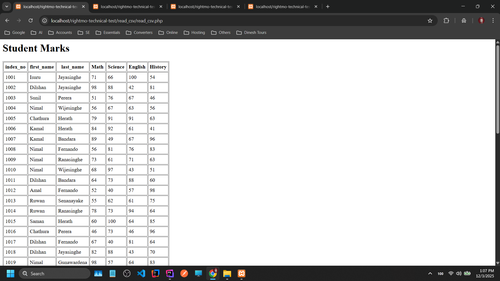
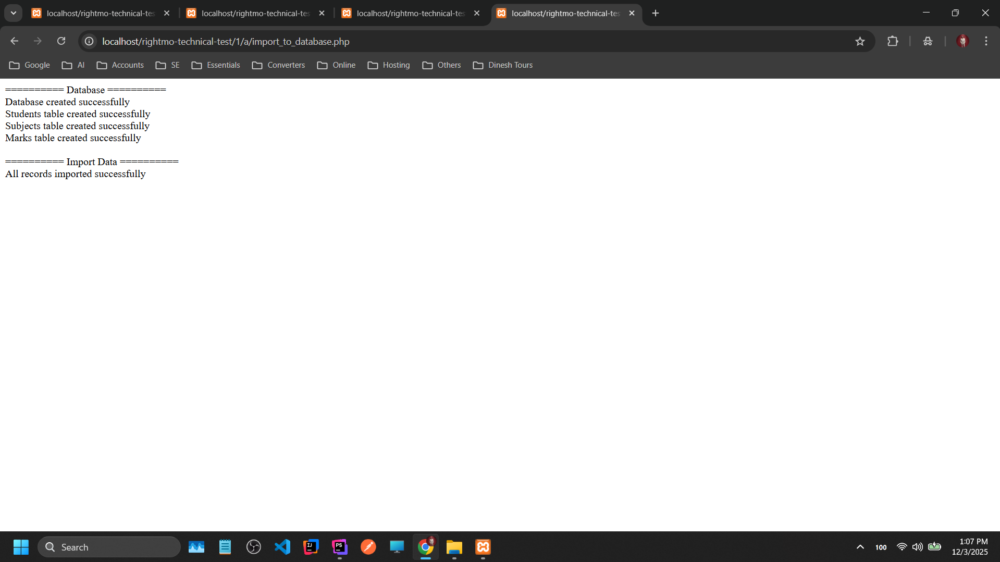
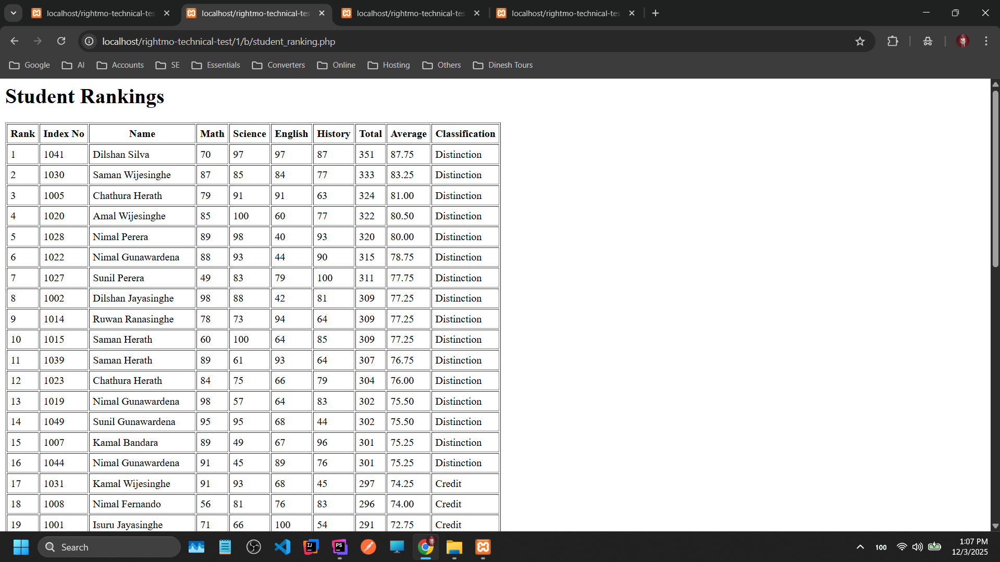
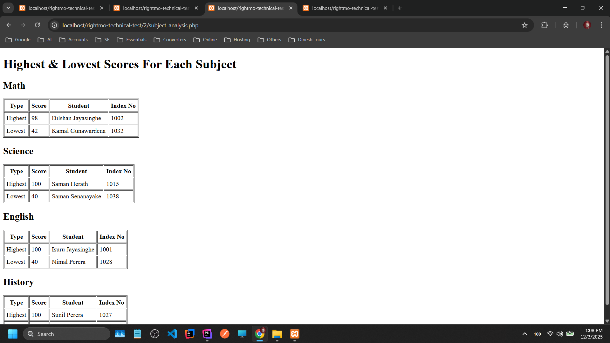

# How to run

1. Start XAMPP
2. Run Apache and MySQL (Or Local MySQL)
3. Place the project folder in the `htdocs` folder
4. The project folder name is `rightmo-technical-test`

### Read CSV

* Open your browser and navigate to `http://localhost/rightmo-technical-test/read_csv/read_csv.php`

### Import to Database

* Open your browser and navigate to `http://localhost/rightmo-technical-test/1/a/import_to_database.php`

### Student Ranking

* Open your browser and navigate to `http://localhost/rightmo-technical-test/1/b/student_ranking.php`

### Subject Analysis

* Open your browser and navigate to `http://localhost/rightmo-technical-test/2/subject_analysis.php`

### Read CSV

### Import to Database

### Student Ranking

### Subject Analysis

